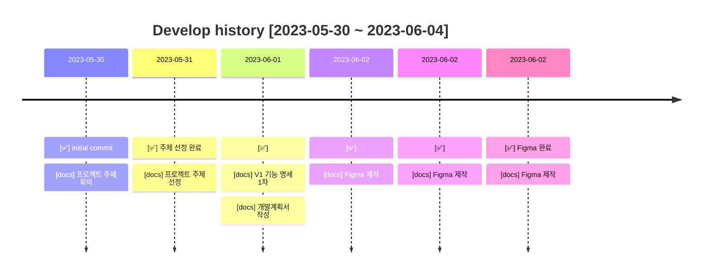
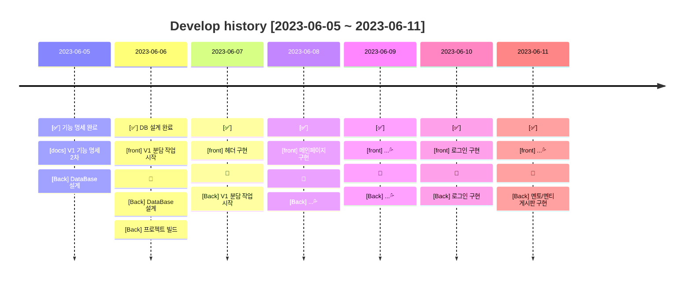
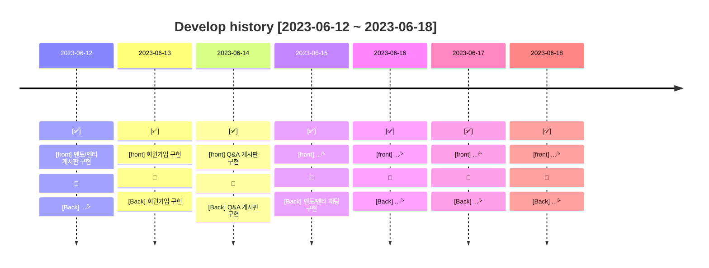
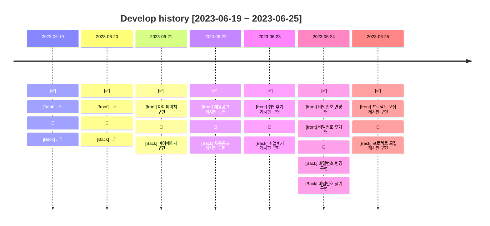
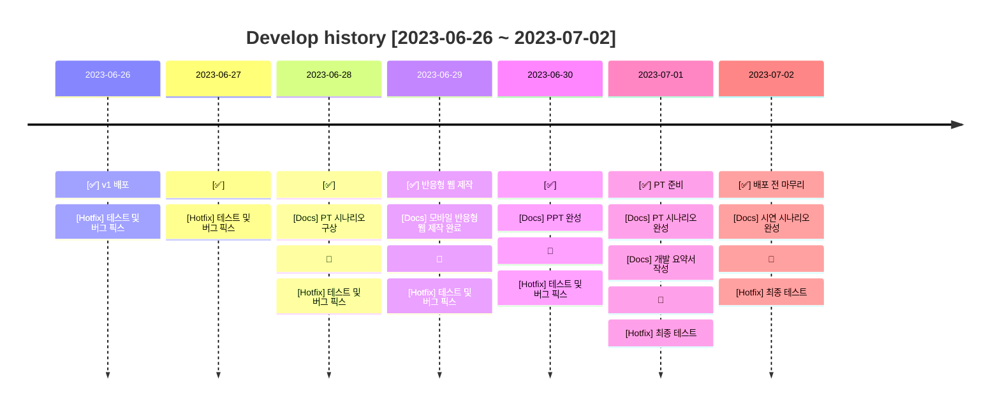
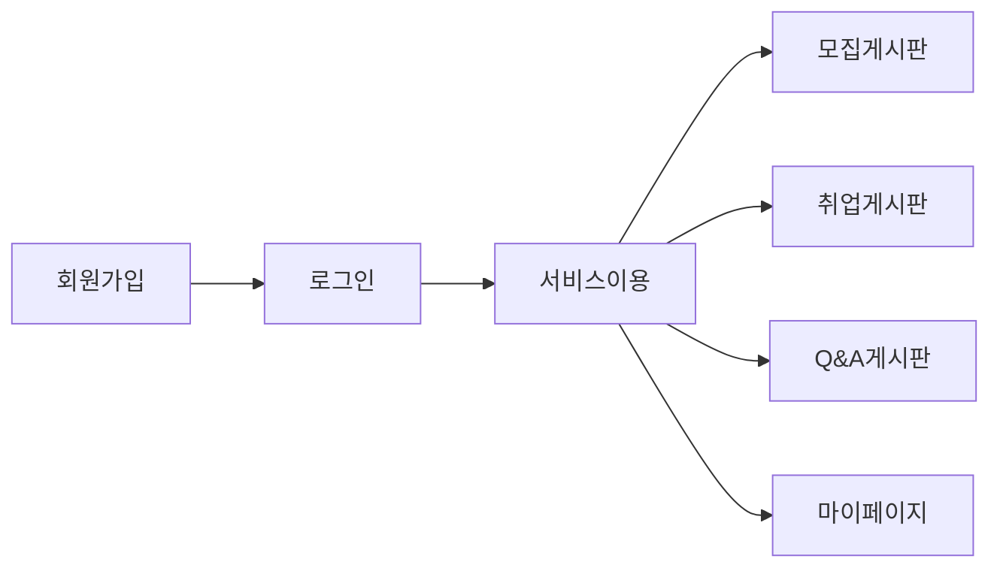
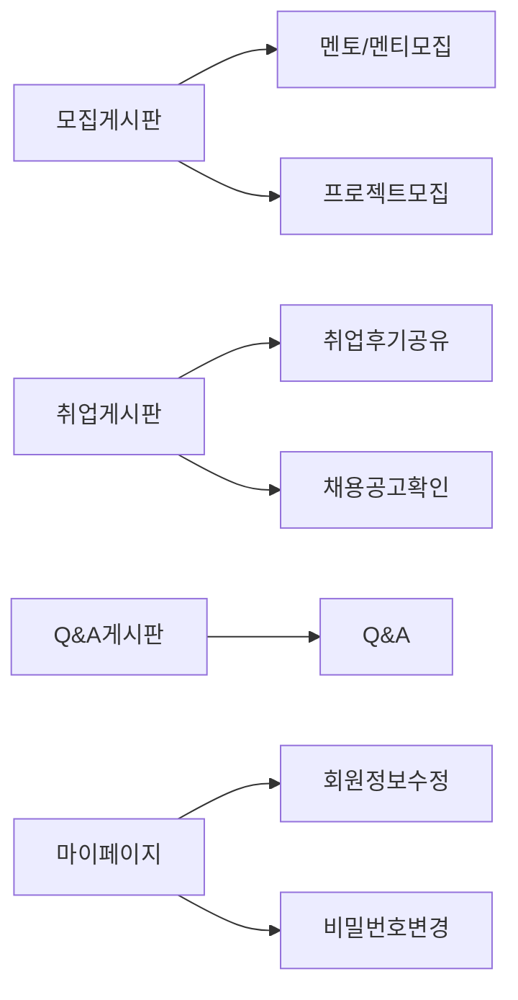

traplaner
# TRAPLAN

※MainPage
   

### 목차

1. [서비스 개요](#📢-서비스-개요)
2. [팀원 소개](#👋-팀원)
3. [기술 스택](#🔨-기술-스택)
4. [주요 기능 및 로직 소개](#🎯-주요-기능-및-로직-소개)
5. [개발 이력](#📜-개발-이력)
6. [버전 정보](#💡-버전-정보)
7. [DataBase](#⚙-DataBase)
8. [Git Flow](#🐱‍🏍-Git-Flow)

  

### 📢 서비스 개요

---

#### 본 프로젝트는 여행 계획을 작성하는 데 도움을 주고,
#### 다른 유저들과 여행 후기를 공유할 수 있는 소셜네트워킹 여행 플랜 웹 어플리케이션입니다.

 

TRAPLAN은 "TRAVEL"과 "PLAN"의 합성어로, 여행할 때 필요한 정보를 관리합니다.

여행 일정과 목적지, 예산, 바우처정보 등을 한 곳에 모아 다이어리처럼 관리할 수 있습니다.

여행 정보 및 후기는 다른 유저들과 공유할 수 있습니다.

공유하고 싶은 여행 정보 및 후기만 공유할수도 있습니다.

### TRAPLAN의 회원이 되어 여행 계획을 공유해보실래요? 😉

  

### 👋 팀원

---

| 이름        | 담당                      | GITHUB                         |
|-----------|-------------------------|--------------------------------|
| 👩‍💻 이진규 | PM, FRONT, BACK | https://github.com/sup226     |
| 👨‍💻 김민지 | FRONT, BACK, UI/UX     | https://github.com/sup226 |
| 👨‍💻 전상윤 | FRONT, BACK     | https://github.com/oslob99     |
| 👩‍💻 정재훈 | FRONT, BACK     | https://github.com/Hazel0c0    |
| 👩‍💻 최현진 | FRONT, BACK     | https://github.com/Hazel0c0    |

  

### 🔨 기술 스택
---
#### 📜 FRONT

  
  
  

#### 🛠️ BACK

  
  
  

#### 📀 DB

  

#### ✂️ Tool

  
  

#### ⭐️ etc

  
  
  
  지라, 슬랙, 피그마, 스프레드시트, 마이바티스, ERD클라우드드

 

  

### 🎯 주요 기능 및 로직 소개

---

### 📄 회원가입 & 로그인
- 회원은 일반, 카카오 계정을 통해 회원가입 및 로그인이 가능합니다.
- 비밀번호를 잊은 회원은 이메일 인증을 통해 [비밀번호 변경] 할 수 있습니다.

### 📄 메인페이지
- 좋아요를 가장 많이 받은 게시글 3개를 보여줍니다.
- 나의 여행 계획을 작성하는 버튼이 있습니다.
- 나의 지난 여행에 바로 접근할 수 있습니다.

### 📄 여행계획페이지
- 달력을 통해 전체 여행 기간을 설정할 수 있습니다.
- 여행의 이름을 작성할 수 있습니다.
- 일정일별로 여정을 추가하고 삭제할 수 있습니다. (시간, 여정 이름, 장소 이름, 장소 주소, 예산, 예약바우처 파일)
- 장소 주소는 구글맵API를 통해 장소를 조회하는 즉시 위치를 오른쪽 지도에서 눈으로 확인할 수 있습니다.
- 예산은 자동으로 계산되어 여행 기간동안의 총예산을 확인할 수 있습니다.

### 📄 마이페이지
1. 나의 일정
   - 달력에서 나의 전체 여행 일정을 쉽게 확인할 수 있습니다.
2. 나의 여행
   - 갈 여행과 다녀온 여행 정보들을 한 화면에서 통합 관리할 수 있다.
   - 게시글 작성, 게시여부, 삭제를 할 수 있습니다.
3. 내 게시물
   - 나의 여행에서 게시여부를 선택한 게시물만 모아서 볼 수 있습니다.
   - 제목을 누르면 해당 게시물로 이동합니다.
4. 좋아요한 게시물
   - 게시판에 있는 게시물 중 좋아요를 누른 게시물만 모아서 볼 수 있습니다.
   - 제목을 누르면 해당 게시물로 이동합니다. 
5. 계정관리
- 나의 비밀번호 및 닉네임을 변경할 수 있습니다.

### 나의 여행 작성 페이지
- 여행을 다녀온 뒤에 마이페이 나의 여행에서 제목을 누르면 나의 여행을 작성할 수 있습니다.
- 여행 후기와 대표 사진, 여정별로 사진을 등록할 수 있습니다.

### 📄 게시판 페이지
- 다른 유저들이 공유한 게시글(여행후기)을 볼 수 있습니다.
- 옵션을 선택하여 최신순/과거순/좋아요순으로 정렬할 수 있습니다.
- 옵션을 선택하여 제목/작성자/내용/제목+내용에 맞게 검색할 수 있습니다.
- 게시글을 누르면 여행후기가 새 탭에서 띄워집니다.

### 게시글(여행후기) 페이지
- 대표사진과 후기, 일정별 경로와 여정의 사진 및 정보를 볼 수 있습니다.

### 📜 개발 이력

---

### 🕘 개발 기간 (10일)
2024-10-21 ~ 2024-10-30

 

  

### 💡 버전 정보

---

#### ✅ v1.0.0

---

        

  

### ⚙ DataBase

---
### 14 TABLES

  

### 🐱‍🏍 Git Flow

---

- #### main : 우리의 서비스가 출시되는 브랜치

> 1. 태그를 달아서 버전을 알려줍니다.
> 2. develop 브랜치만 merge 합니다.  
     $git merge develop  
     $git tag "v1.0.0"

- #### develop : 다음 출시 버전을 개발하는 브랜치

> 1. feature 브랜치들에서 개발한 병합합니다.
> 2. 커밋 이력을 남기기 위해 '--no-ff' 옵션을 부여합니다.  
     $git merge --no-ff feature/[기능]/

- #### feature/[기능] : 기능을 개발하는 브랜치

> ex. feature/login : 로그인 기능을 개발하는 브랜치
